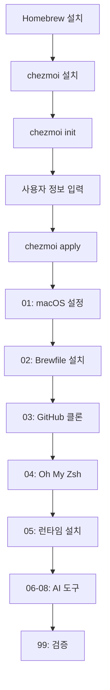

# Dotfiles 프로젝트 구조

## 개요

이 프로젝트는 chezmoi를 사용하여 macOS 개발 환경을 자동으로 설정합니다. 특히 AI 개발 도구와 CLI 환경을 중심으로 구성되어 있습니다.

## 디렉토리 구조

```
dotfiles/
├── .chezmoi.toml.tmpl              # chezmoi 설정 (템플릿)
├── .chezmoiignore                  # chezmoi가 무시할 파일 목록
├── .gitignore                      # Git 무시 파일 목록
├── .macos                          # macOS 설정 스크립트 (레거시)
├── Brewfile                        # Homebrew 패키지 목록
├── README.md                       # 프로젝트 설명
├── CLAUDE.md                       # Claude Code 자동화 규칙
├── AGENTS.md                       # Agent 설정
├── AUTOMATION.md                   # 자동화 문서
├── llms.txt                        # LLM 컨텍스트 문서
├── docs/                           # 문서 디렉토리
│   ├── chezmoi-basics.md          # Chezmoi 기본 가이드
│   ├── file-naming-conventions.md  # 파일 명명 규칙
│   ├── template-syntax.md          # 템플릿 문법
│   ├── lifecycle-scripts.md        # 생명주기 스크립트
│   └── project-structure.md        # 프로젝트 구조 (현재 문서)
├── dot_bashrc                      # Bash 설정
├── dot_gitconfig.tmpl              # Git 설정 (템플릿)
├── dot_gitignore_global            # 전역 Git ignore
├── dot_vimrc                       # Vim 설정
├── dot_zshrc                       # Zsh 설정
└── run_once_*.sh                   # 초기화 스크립트들
```

## 핵심 파일 설명

### 설정 파일

#### `.chezmoi.toml.tmpl`

chezmoi의 메인 설정 파일입니다. 최초 실행 시 사용자 정보를 입력받아 저장합니다.

```toml
{{- $name := promptStringOnce . "name" "Full name" -}}
{{- $email := promptStringOnce . "email" "Email address" -}}
{{- $password := promptStringOnce . "password" "Sudo password" -}}

[data]
    name = {{ $name | quote }}
    email = {{ $email | quote }}
    password = {{ $password | quote }}

[edit]
    command = "code"
    args = ["--wait"]
```

**특징:**
- `promptStringOnce`: 한 번만 입력받고 저장
- `[data]`: 다른 템플릿에서 사용할 변수 정의
- `[edit]`: 편집기 설정 (Visual Studio Code)

#### `.chezmoiignore`

chezmoi가 홈 디렉토리에 복사하지 않을 파일 목록입니다.

**주요 무시 항목:**
- 저장소 관리 파일 (README.md, LICENSE)
- IDE 설정 (.idea/, .vscode/)
- 임시 파일 (*.tmp, *.log)
- OS 특정 파일 (.DS_Store)
- 개발 파일 (node_modules/, __pycache__/)
- AI 도구 ignore 파일들

#### `Brewfile`

Homebrew를 통해 설치할 패키지 목록입니다.

**카테고리:**
- 기본 도구 (git, vim, curl, wget)
- 개발 환경 (python, node, go)
- 터미널 도구 (tmux, fzf, ripgrep)
- GUI 애플리케이션 (cask)

### Dotfiles

#### `dot_gitconfig.tmpl`

Git 전역 설정 파일입니다. 템플릿 변수를 사용하여 개인화됩니다.

**주요 설정:**
- 사용자 정보 (name, email)
- 편집기 (vim)
- 별칭 (alias)
- 색상 설정
- Merge/Diff 도구 (VS Code)

#### `dot_zshrc`

Zsh 셸 설정 파일입니다.

**주요 기능:**
- Oh My Zsh 통합
- 별칭 (alias) 정의
- PATH 환경 변수 설정
- 플러그인 로드

#### `dot_bashrc` / `dot_vimrc`

각각 Bash와 Vim의 설정 파일입니다.

## 초기화 스크립트

### 실행 순서

스크립트는 파일명의 숫자 순서대로 실행됩니다:

```
01 → 02 → 03 → 04 → 05 → 06 → 07 → 08 → 99
```

### 스크립트 상세 설명

#### `run_once_01_macos-setting.sh.tmpl`

**목적**: macOS 시스템 환경 설정

**주요 작업:**
1. Xcode Command Line Tools 설치
2. Dock 설정 (자동 숨김, 돋보기 효과, 크기)
3. Finder 설정 (경로 표시, 확장자 표시)
4. Keyboard 설정 (키 반복 속도, 자동 수정 비활성화)
5. Trackpad 설정 (탭하여 클릭)
6. Screenshot 설정 (저장 위치, 포맷)
7. Menu bar 설정 (시계 포맷)

**실행 조건:**
- macOS 전용 (템플릿에서 OS 확인)
- 한 번만 실행 (run_once)

#### `run_once_02_install-brewfile.sh.tmpl`

**목적**: Homebrew 패키지 일괄 설치

**주요 작업:**
1. Homebrew 설치 확인
2. Brewfile의 패키지 설치

**특징:**
- `brew bundle` 사용
- 에러 허용 (|| true)

#### `run_once_03_clone-github.sh.tmpl`

**목적**: GitHub 저장소 클론

**주요 작업:**
1. 작업 디렉토리 생성
2. 자주 사용하는 저장소 클론

**예시 구조:**
```bash
~/Documents/GitHub/
├── project1/
├── project2/
└── ...
```

#### `run_once_04_ohmyzsh-setting.sh`

**목적**: Oh My Zsh 설치 및 설정

**주요 작업:**
1. Oh My Zsh 설치
2. 테마 설정
3. 플러그인 설치

#### `run_once_05_install-runtime-base.sh`

**목적**: 기본 런타임 환경 설치

**주요 작업:**
1. Python 환경 (pyenv, pipenv)
2. Node.js 환경 (nvm, npm)
3. Ruby 환경 (rbenv)
4. Go 환경

#### `run_once_06_install-ai-npm.sh`

**목적**: npm 기반 AI 도구 설치

**주요 도구:**
- `@modelcontextprotocol/cli`
- AI 개발 도구들

#### `run_once_07_install-ai-pipx.sh`

**목적**: pipx 기반 AI 도구 설치

**주요 도구:**
- Python 기반 AI CLI 도구
- 독립 실행형 Python 애플리케이션

#### `run_once_08_install-ai-others.sh`

**목적**: 기타 AI 도구 설치

**주요 작업:**
- 직접 다운로드 방식의 도구
- 특수 설치 방법이 필요한 도구

#### `run_once_99_validate-installation.sh`

**목적**: 설치 검증

**주요 작업:**
1. 필수 도구 확인
2. 버전 체크
3. 설치 완료 리포트

**출력 예시:**
```
[validate-installation]
✓ git
✓ vim
✓ zsh
✓ brew
✗ tool (not found)
[validate-installation] done
```

## 워크플로우

### 초기 설정 프로세스



### 일상적인 사용

```bash
# 1. 설정 파일 수정
chezmoi edit ~/.zshrc

# 2. 변경사항 확인
chezmoi diff

# 3. 적용
chezmoi apply

# 4. Git에 커밋
chezmoi cd
git add .
git commit -m "Update zsh config"
git push
```

### 새 머신에서 설정

```bash
# 1. Homebrew 설치
/bin/bash -c "$(curl -fsSL https://raw.githubusercontent.com/Homebrew/install/HEAD/install.sh)"

# 2. Homebrew 환경 변수 설정
eval "$(/opt/homebrew/bin/brew shellenv)"

# 3. chezmoi 설치 및 dotfiles 적용
brew install chezmoi
chezmoi init kimchanhyung98
chezmoi apply
```

## 디렉토리 구조 규칙

### 소스 상태 (`~/.local/share/chezmoi/`)

```
~/.local/share/chezmoi/
├── .chezmoi.toml.tmpl
├── dot_gitconfig.tmpl          → ~/.gitconfig
├── dot_zshrc                   → ~/.zshrc
└── run_once_01_*.sh.tmpl       → 실행 후 삭제되지 않음
```

### 타겟 상태 (홈 디렉토리)

```
~/
├── .gitconfig                  # dot_gitconfig.tmpl에서 생성
├── .zshrc                      # dot_zshrc에서 생성
├── .vimrc                      # dot_vimrc에서 생성
└── ...
```

### chezmoi 상태 관리

```
~/.config/chezmoi/
├── chezmoi.toml                # 생성된 설정
└── chezmoistate.boltdb         # 스크립트 실행 상태
```

## 특수 파일 목적

### 문서 파일

- `README.md`: 프로젝트 개요 및 설치 방법
- `CLAUDE.md`: Claude Code AI 어시스턴트 자동화 규칙
- `AGENTS.md`: Agent 설정 및 사용법
- `AUTOMATION.md`: 자동화 워크플로우
- `llms.txt`: LLM을 위한 프로젝트 컨텍스트

### 레거시 파일

- `.macos`: 구버전 macOS 설정 스크립트 (현재는 run_once_01 사용)

## 확장 가이드

### 새 dotfile 추가

```bash
# 1. 파일을 chezmoi로 추가
chezmoi add ~/.config/nvim/init.vim

# 2. 소스 파일 확인
chezmoi cd
ls -la

# 3. 파일명 확인 (dot_config/nvim/init.vim)
```

### 새 스크립트 추가

```bash
# 1. 적절한 번호와 이름으로 스크립트 생성
chezmoi cd
touch run_once_10_install_docker.sh.tmpl

# 2. 스크립트 작성
vim run_once_10_install_docker.sh.tmpl

# 3. 테스트
chezmoi apply --dry-run --verbose
```

### 템플릿 변수 추가

```bash
# 1. .chezmoi.toml.tmpl 수정
chezmoi edit ~/.config/chezmoi/chezmoi.toml

# 2. 새 변수 추가
{{- $custom_var := promptStringOnce . "custom" "Custom value" -}}

[data]
    custom = {{ $custom_var | quote }}
```

## 모범 사례

### 1. 버전 관리

```bash
# 의미 있는 커밋 메시지
git commit -m "Add Docker installation script"
git commit -m "Update zsh aliases for new workflow"
```

### 2. 테스트

```bash
# 적용 전 항상 확인
chezmoi diff
chezmoi apply --dry-run --verbose
```

### 3. 백업

```bash
# 중요 변경 전 백업
cp ~/.zshrc ~/.zshrc.backup
```

### 4. 문서화

- 복잡한 스크립트에는 주석 추가
- README 업데이트
- llms.txt 자동 업데이트 (CLAUDE.md 규칙)

## 문제 해결

### 스크립트가 실행되지 않음

```bash
# 상태 초기화
chezmoi state delete-bucket --bucket=scriptState

# 다시 적용
chezmoi apply
```

### 템플릿 에러

```bash
# 템플릿 결과 확인
chezmoi cat ~/.gitconfig

# 템플릿 데이터 확인
chezmoi data
```

### 파일 동기화 문제

```bash
# 강제 적용
chezmoi apply --force

# 소스와 타겟 비교
chezmoi verify
```

## 참고 자료

- [Chezmoi 기본 가이드](./chezmoi-basics.md)
- [파일 명명 규칙](./file-naming-conventions.md)
- [템플릿 문법](./template-syntax.md)
- [생명주기 스크립트](./lifecycle-scripts.md)

## 기여하기

1. 새 기능 추가 시 문서 업데이트
2. llms.txt 자동 업데이트 확인
3. 테스트 후 커밋
4. 의미 있는 커밋 메시지 작성
